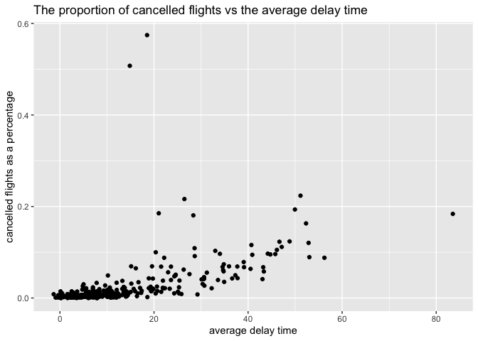

HW2
================
Xingjian Yan
2/11/2021

\#\#\#\#1.How many flights have a missing dep\_time? What other
variables are missing? What might these rows represent?

``` r
flights %>% summarize(missing_delay = mean(is.na(dep_time)))
```

    ## # A tibble: 1 x 1
    ##   missing_delay
    ##           <dbl>
    ## 1        0.0245

*About 2.45% dep\_time were missing, other variables, such as
dep\_delay, arr\_time, arr\_delay, air\_time, are also missing. These
rows might represent flights that were canceled.*

\#\#\#\#2.Currently dep\_time and sched\_dep\_time are convenient to
look at, but hard to compute with because they’re not really continuous
numbers. Convert them to a more convenient representation of number of
minutes since midnight.

``` r
flights %>% select(dep_time, sched_dep_time, hour, minute) %>%  mutate(
  dep_hour = dep_time %/% 100,
  dep_minute = dep_time %% 100,
  dep_total_minutes = 60*dep_hour + dep_minute,
  sched_dep_total_minutes = 60*hour + minute) %>% select(dep_time, sched_dep_time,dep_total_minutes, sched_dep_total_minutes)
```

    ## # A tibble: 336,776 x 4
    ##    dep_time sched_dep_time dep_total_minutes sched_dep_total_minutes
    ##       <int>          <int>             <dbl>                   <dbl>
    ##  1      517            515               317                     315
    ##  2      533            529               333                     329
    ##  3      542            540               342                     340
    ##  4      544            545               344                     345
    ##  5      554            600               354                     360
    ##  6      554            558               354                     358
    ##  7      555            600               355                     360
    ##  8      557            600               357                     360
    ##  9      557            600               357                     360
    ## 10      558            600               358                     360
    ## # … with 336,766 more rows

\#\#\#\#3.Look at the number of cancelled flights per day. Is there a
pattern? Is the proportion of cancelled flights related to the average
delay? Use multiple dyplr operations, all on one line, concluding with
ggplot(aes(x= ,y=)) + geom\_point()

``` r
flights %>% mutate(day_of_year = yday(time_hour)) %>% group_by(day_of_year) %>% summarize(missing_delay = mean(is.na(dep_time)), delay = mean(dep_delay, na.rm = T)) %>% ggplot(aes(y=missing_delay,x= delay ))+geom_point() + ggtitle("The proportion of cancelled flights vs the average delay time") + ylab("cancelled flights as a percentage") + xlab("average delay time")
```

<!-- -->
